# Paddle Paddle Hackathon（第三期 61）

## **1.任务描述**

近三年来，随着深度学习等数据驱动方法的快速发展，为科学计算提供了新的解决方案。学者们进一步从数据和知识融合的角度出发，充分挖掘数据内蕴规律与物理第一性原理，以期实现无网格的、无限分辨率的物理过程的求解、预测、辨识和重构等更加灵活的任务，其中 **Physics informed neural networks(PINNs)** 的工作在损失，；相关研究工作是AI for Science领域中的一个研究热点。**非定常圆柱绕流** 是计算流体力学（CFD）中的基础问题，在很多相关工作中作为模型的验证算例。

本任务中，作者在 **PaddleScience** 的 2D 非定常圆柱绕流 Demo 的基础上，从以下5个方面对PINNs进行了调优：

- 探讨了2D 非定常圆柱绕流的物理场预测任务中不同网络深度对于物理场预测精度的影响；
- 探讨了2D 非定常圆柱绕流的物理场预测任务中不同网络宽度对于物理场预测精度的影响；
- 探讨了2D 非定常圆柱绕流的物理场预测任务中不同归一化处理方法对于物理场预测精度的影响；
- 探讨了2D 非定常圆柱绕流的物理场预测任务中不同激活函数对于物理场预测精度的影响；
- 探讨了2D 非定常圆柱绕流的物理场预测任务中不同网络模型（一个网络同时预测所有物理场/搭建多个网络分别预测单个物理场）对于物理场预测精度的影响；

## 2.代码描述

### 2.1 代码说明

1. [PINNs_Cylinder AI studio](https://aistudio.baidu.com/aistudio/projectdetail/4529544)相关运行结果

  - run_train_pdpd.py   为训练主程序
  - run_tvalidate_pdpd.py  为验证主程序
  - basic_model_pdpd.py  为本问题所涉及到的基础全连接网络,
  - visual_data.py  为数据可视化
  - process_data_pdpd.py  为数据预处理

  - **work文件夹**中为模型训练过程及验证可视化
    - \train  训练集数据 & 训练过程的可视化
    - \validation 验证数据的可视化
    - train.log 所有训练过程中的日志数据保存
    - valida.log 所有训练过程中的日志数据保存
    - latest_model.pth 模型文件

  - **data文件夹**中为非定常2D圆柱绕流数据，可从以下链接获取
    链接：https://pan.baidu.com/s/1RtBQaEzZQon0cxSzmau7kg 
    提取码：0040


### 2.2 环境依赖

  > numpy == 1.22.3 \
  > scipy == 1.8.0  \
  > paddlepaddle-gpu == 2.3.2 \
  > paddle==2.3.2 \
  > matplotlib==3.5.1 \


## 3.数据集说明


该数据集为Re=250时的二维层流圆柱绕流数值计算结果，包括了压力场 *p*、*x*方向速度场 *u* 和*y*方向速度场 *v* 在一个周期内共120个时间切片，该问题的Navier-Stokes控制方程可表示为

$$
\frac{\partial u}{\partial x} + \frac{\partial v}{\partial y} = 0 
$$

$$
\frac{\partial u}{\partial t} + u\frac{\partial u}{\partial x} + v\frac{\partial u}{\partial y} = -\frac{1}{\rho}\frac{\partial p}{\partial x} + \frac{\mu}{\rho}(\frac{\partial ^2 u}{\partial x ^2} + \frac{\partial ^2 u}{\partial y ^2})
$$

$$
\frac{\partial v}{\partial t} + u\frac{\partial v}{\partial x} + v\frac{\partial v}{\partial y} = -\frac{1}{\rho}\frac{\partial p}{\partial y} + \frac{\mu}{\rho}(\frac{\partial ^2 v}{\partial x ^2} + \frac{\partial ^2 v}{\partial y ^2})
$$

该圆柱（直径为c=1.0m）绕流问题的计算域以及相应边界条件如下图所示：本模型所文献[1]采用的直径约64c的同心圆形域，入口边界为速度入口（ $u=U_0,v=0$ ）,其中 $U_0=1m/s$ ，出口边界为出流边界，即速度在边界上符合（ $\partial u/ \partial\vec{\bf{n}}=0,\partial v/ \partial\vec{\bf{n}}=0$ ），圆柱表面为无滑移边界条件。在数值计算中采用标准的物理场初始化方法（ $u=U_0,v=0,p=0$ ），采用SIMPLE算法耦合压力-速度项，二阶和二阶迎风算法空间离散压力和动量项，二阶隐式进行时间离散。工质物性设置为 $\rho=1,U_0=1$ ，而 $\mu$ 由Re=250决定，此时，该工况的控制方程可简便的无量纲化，无量纲方法为：

$$
x^*=x/c, y^*=y/c, u^*=u/U_0, v^*=v/U_0, p^*=\frac{p}{\rho c U_0^2}
$$

但是为了方便表示仍采用原本的符号表示，无量纲控制方程为：

$$
eq_1 :\frac{\partial u}{\partial x} + \frac{\partial v}{\partial y} = 0 
$$

$$
eq_2 :\frac{\partial u}{\partial t} + u\frac{\partial u}{\partial x} + v\frac{\partial u}{\partial y} + \frac{\partial p}{\partial x} - \frac{1}{Re}(\frac{\partial ^2 u}{\partial x ^2} + \frac{\partial ^2 u}{\partial y ^2}) = 0
$$

$$
eq_3 :\frac{\partial v}{\partial t} + u\frac{\partial v}{\partial x} + v\frac{\partial v}{\partial y} +\frac{\partial p}{\partial y} -\frac{1}{Re}(\frac{\partial ^2 v}{\partial x ^2} + \frac{\partial ^2 v}{\partial y ^2})
$$

paddle 实现代码如下：

```python
class Net_single(DeepModel_single):  
    def __init__(self, planes, data_norm):  
        super(Net_single, self).__init__(planes, data_norm, active=nn.Tanh())  
        self.Re = 250.  
  
    def equation(self, inn_var, out_var):  
        # a = grad(psi.sum(), in_var, create_graph=True, retain_graph=True)[0]  
        p, u, v = out_var[:, 0:1], out_var[:, 1:2], out_var[:, 2:3]  
  
        duda = gradients(u, inn_var)  
        dudx, dudy, dudt = duda[:, 0:1], duda[:, 1:2], duda[:, 2:3]  
        dvda = gradients(v, inn_var)  
        dvdx, dvdy, dvdt = dvda[:, 0:1], dvda[:, 1:2], dvda[:, 2:3]  
        d2udx2 = gradients(dudx, inn_var)[:, 0:1]  
        d2udy2 = gradients(dudy, inn_var)[:, 1:2]  
        d2vdx2 = gradients(dvdx, inn_var)[:, 0:1]  
        d2vdy2 = gradients(dvdy, inn_var)[:, 1:2]  
        dpda = gradients(p, inn_var)  
        dpdx, dpdy = dpda[:, 0:1], dpda[:, 1:2]  
  
        eq1 = dudt + (u * dudx + v * dudy) + dpdx - 1 / self.Re * (d2udx2 + d2udy2)  
        eq2 = dvdt + (u * dvdx + v * dvdy) + dpdy - 1 / self.Re * (d2vdx2 + d2vdy2)  
        eq3 = dudx + dvdy  
        eqs = paddle.concat((eq1, eq2, eq3), axis=1)  
        return eqs
```

边界条件的数学表达式为

|   边界条件   |                             公式                             |
| :----------: | :----------------------------------------------------------: |
|   入口边界   |                  $bq_1: u-U_0=0; bq_2: v=0$                  |
|   出口边界   | $bq_3: \frac{\partial u}{\partial\vec{\bf{n}}}=0; bq_4: \frac{\partial v}{\partial\vec{\bf{n}}}=0$ |
| 圆柱壁面边界 |                   $bq_5:  u=0; bq_6:  v=0$                   |
| 初始边界条件 | $in_1:  {u- u_{initial}}=0;in_2:  v- v_{initial}=0;in_3:  p- p_{initial}=0$ |


| 计算域示意图         | 网格划分示意图     |
| -------------------- | ------------------ |
| 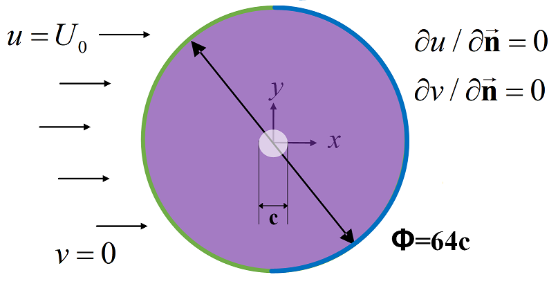 | 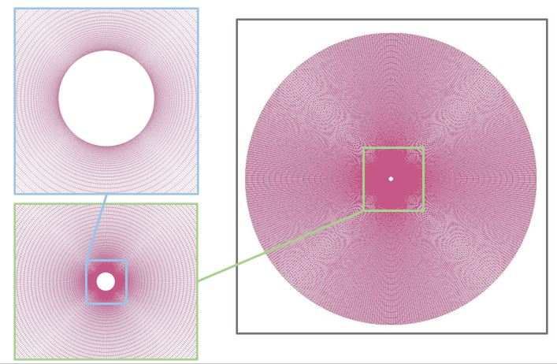 |

考虑的气动性能参数包括刚体表面的受力，即y方向上的升力和x方向上的阻力，这些性能参数可以表示为物理场在圆柱表面的积分形式：

$$
\vec{F}(t)= [F_x(t), F_y(t)]^T= \oint{(-p \vec{\bf{n}}+\frac{\mu}{\rho}(\nabla \vec{\bf{u}}+ \nabla \vec{\bf{u}}^T) \cdot \vec{\bf{n}})ds}
$$

对应的升力和阻力系数可表示为：

$$
C_l=\frac{F_x}{\frac{1}{2}\rho c U_0^2}, C_d=\frac{F_y}{\frac{1}{2}\rho c U_0^2}
$$

为了验证圆柱绕流数值计算的准确性，下图展示了升力系数和阻力系数与其他研究的对比。由图可知，在 Re=60～500范围内，本文所采用的数值计算方法得到的系数与文献[1-5]的研究基本吻合，验证了本算例所采用的Re = 250 的计算精度。

| 阻力系数曲线       | 升力系数曲线       |
| ------------------ | ------------------ |
| 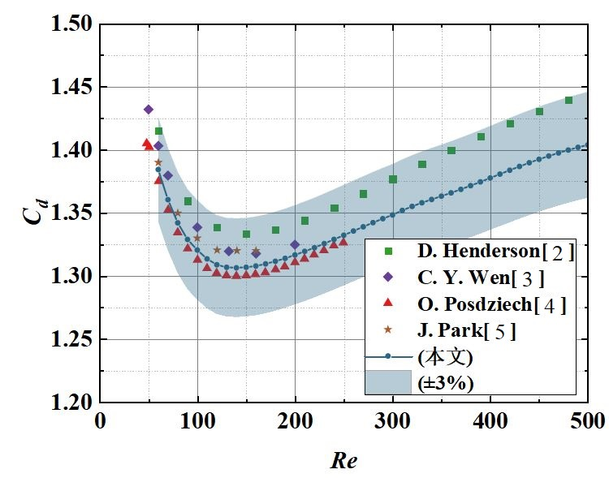 | 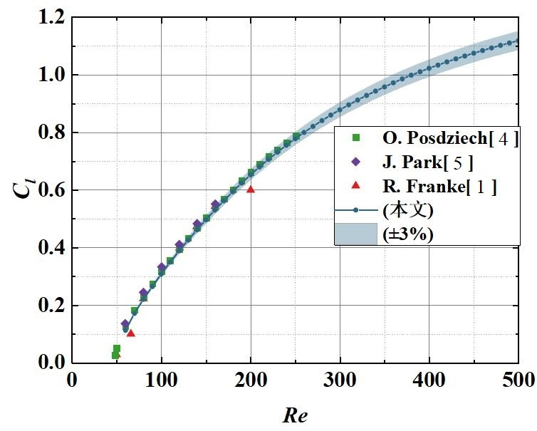 |

数据读入见代码：

```python
def read_data():  
    data = h5py.File('./data/cyl_Re250.mat', 'r')  
  
    nodes = np.array(data['grids_']).squeeze().transpose((3, 2, 1, 0)) # [Nx, Ny, Nf]  
    field = np.array(data['fields_']).squeeze().transpose((3, 2, 1, 0)) # [Nt, Nx, Ny, Nf]  
    times = np.array(data['dynamics_']).squeeze().transpose((1, 0))[3::4, (0,)] # (800, 3) -> (200, 1)  
    nodes = nodes[0]  
    times = times - times[0, 0]  
  
    return times[:120], nodes[:, :, 1:], field[:120, :, :, :]  
```

## 4.模型描述

本模型采用 Physics informed neural network (PINN) 模型， 以每个采样点的时空坐标为输入，物理场为输出，该模型的数学表达式为

$$
f(t,x,y)= [p,u,v]^T
$$

综合的损失函数为监测点损失、控制方程损失和所有的边界条件损失：

$$
综合损失： L_{tol}= w_1 L_{sup} +  w_2 L_{eq} +  w_3 L_{bq} +  w_4 L_{in}
$$

$$
监督点损失： L_{sup}=\frac{1}{n_{sup}}\sum_{i=1}^{n_{sup}}{sqrt(({\bf{f}}_{sup}^i - \hat{\bf{f}}_{sup}^i)^2)}
$$

$$
控制方程损失： L_{eq}=\frac{1}{n_{eq}}\sum_{i,j=1}^{i,j=n_{eq},3}{sqrt({{\bf{eq}}_{j}^{i}}^2)}
$$

$$
边界条件损失： L_{bq}=\frac{1}{n_{bq}}\sum_{i,j=1}^{i,j=n_{bq},6}{sqrt({{\bf{bq}}_{j}^{i}}^2)}
$$

$$
初始条件损失： L_{in}=\frac{1}{n_{in}}\sum_{i,j=1}^{i,j=n_{in},3}{sqrt({{\bf{in}}_{j}^{i}}^2)}
$$

需要注意的是，由于该数据集仅采用了稳定后的一个周期内的物理场，因此初始边界损失中的物理场应为周期中初始时刻的物理场。

**模型的详细参数和训练方法总结如下**：

* 本模型共采用两种网络模型如下图所示：第一种是常规的PINN模型，即采用单个全连接网络同时预测所有的物理场，以‘single’表示；第二种针对每个物理场分别搭建一个全连接网络，以‘multi’表示。

| 类型   | 模型框架                           |
| ------ | ---------------------------------- |
| single | 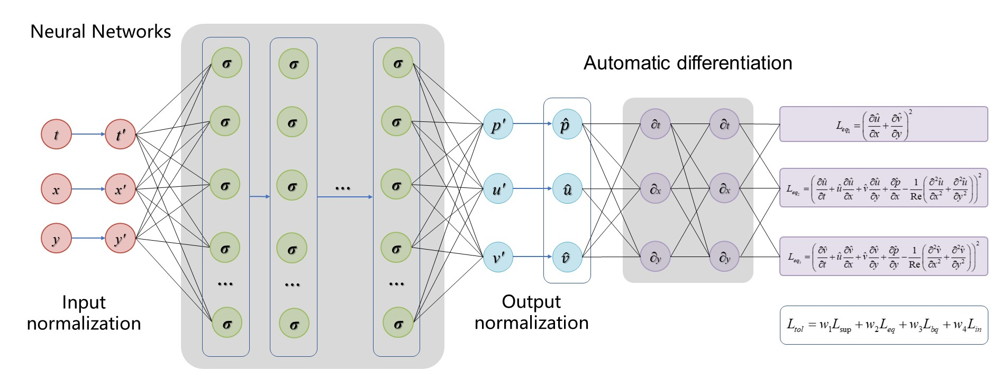 |
| multi  | 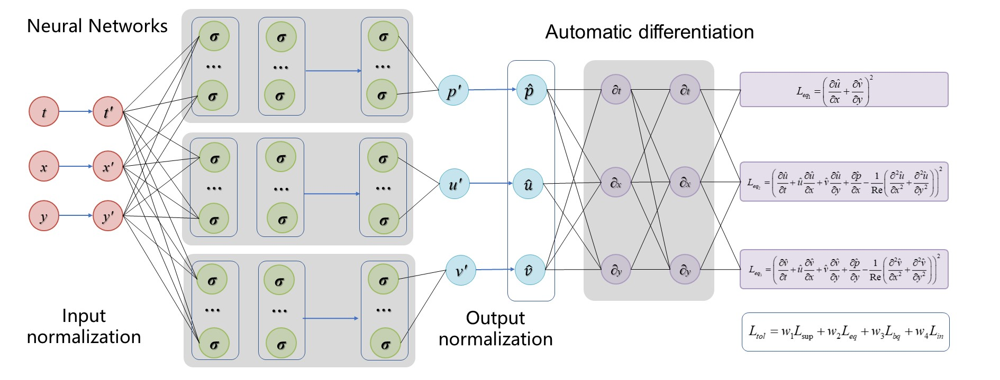   |

网络模型的设置方法如下：

``` python
parser.add_argument('--Net_pattern', default='single', type=str, help="single or multi networks")
```

而两种网络模型的具体搭建、使用流程可见 basic_model_pdpd.py文件中的DeepModel_multi 类和DeepModel_single类：

```python
class DeepModel_multi(nn.Layer):
    def __init__(self, planes, data_norm, active=nn.GELU()):
        super(DeepModel_multi, self).__init__()
        self.planes = planes
        self.active = active

        self.x_norm = data_norm[0]
        self.f_norm = data_norm[1]
        self.layers = nn.LayerList()

        for j in range(self.planes[-1]):
            layer = []
            for i in range(len(self.planes) - 2):
                layer.append(nn.Linear(self.planes[i], self.planes[i + 1], weight_attr=nn.initializer.XavierNormal()))
                layer.append(self.active)
            layer.append(nn.Linear(self.planes[-2], 1, weight_attr=nn.initializer.XavierNormal()))
            self.layers.append(nn.Sequential(*layer))
            # self.layers[-1].apply(initialize_weights)

    def forward(self, in_var, in_norm=True, out_norm=True):
        if in_norm:
            in_var = self.x_norm.norm(in_var)
        # in_var = in_var * self.input_transform
        y = []
        for i in range(self.planes[-1]):
            y.append(self.layers[i](in_var))
        if out_norm:
            return self.f_norm.back(paddle.concat(y, axis=-1))
        else:
            return paddle.concat(y, axis=-1)

    def loadmodel(self, File):
        try:
            checkpoint = paddle.load(File)
            self.set_state_dict(checkpoint['model'])  # 从字典中依次读取
            start_epoch = checkpoint['epoch']
            print("load start epoch at " + str(start_epoch))
            log_loss = checkpoint['log_loss']  # .tolist()
            return start_epoch, log_loss
        except:
            print("load model failed！ start a new model.")
            return 0, []

    def equation(self, inv_var, out_var):
        return 0
  
class DeepModel_single(nn.Layer):
    def __init__(self, planes, data_norm, active=nn.GELU()):
        super(DeepModel_single, self).__init__()
        self.planes = planes
        self.active = active

        self.x_norm = data_norm[0]
        self.f_norm = data_norm[1]
        self.layers = nn.LayerList()
        for i in range(len(self.planes) - 2):
            self.layers.append(nn.Linear(self.planes[i], self.planes[i + 1], weight_attr=nn.initializer.XavierNormal()))
            self.layers.append(self.active)
        self.layers.append(nn.Linear(self.planes[-2], self.planes[-1], weight_attr=nn.initializer.XavierNormal()))

        self.layers = nn.Sequential(*self.layers)
        # self.apply(initialize_weights)

    def forward(self, inn_var, in_norm=True, out_norm=True):
        if in_norm:
            inn_var = self.x_norm.norm(inn_var)
        out_var = self.layers(inn_var)
        if out_norm:
            return self.f_norm.back(out_var)
        else:
            return out_var

    def loadmodel(self, File):
        try:
            checkpoint = paddle.load(File)
            self.set_state_dict(checkpoint['model'])  # 从字典中依次读取
            start_epoch = checkpoint['epoch']
            print("load start epoch at " + str(start_epoch))
            log_loss = checkpoint['log_loss']  # .tolist()
            return start_epoch, log_loss
        except:
            print("load model failed！ start a new model.")
            return 0, []

    def equation(self, **kwargs):
        return 0
```

* 对于‘single’网络模型而言，共有**N_depth** 层全连接层，每层各由 **N_width** 个神经元，输入层为3（t、x、y），输出层为3，对应物理场p、u、v；网络的深度和宽度参数的设置方法如下：

``` python
parser.add_argument('--Layer_depth', default=6, type=int, help="Number of Layers depth")  
parser.add_argument('--Layer_width', default=64, type=int, help="Number of Layers width")
```

而网络的具体搭建采用如下方法：

``` python
planes = [3,] + [opts.Layer_width] * opts.Layer_depth + [3,]  
if opts.Net_pattern == "single":  
    Net_model = Net_single(planes=planes, data_norm=(input_norm, field_norm)).to(device)  
elif opts.Net_pattern == "multi":  
    Net_model = Net_multi(planes=planes, data_norm=(input_norm, field_norm)).to(device)
```

* 针对是否进行归一化操作，分别测试了（1）对输入（t,x,y）和输出（p、u、v）均不进行归一化处理；（2）仅对输入（t,x,y）进行归一化处理；（3）仅对输出（p、u、v）进行归一化处理；（4）同时对输入（t,x,y）和输出（p、u、v）进行归一化处理；设置方法如下：

```python
parser.add_argument('--in_norm', default=True, type=bool, help="input feature normalization")
parser.add_argument('--out_norm', default=True, type=bool, help="output fields normalization")
```

而具体代码见 process_data.py 文件中的 data_norm类

```python
class data_norm():

    def __init__(self, data, method="min-max"):
        axis = tuple(range(len(data.shape) - 1))
        self.method = method
        if method == "min-max":
            self.max = np.max(data, axis=axis)
            self.min = np.min(data, axis=axis)
            self.max_ = paddle.to_tensor(self.max)
            self.min_ = paddle.to_tensor(self.min)

        elif method == "mean-std":
            self.mean = np.mean(data, axis=axis)
            self.std = np.std(data, axis=axis)
            self.mean_ = paddle.to_tensor(self.mean)
            self.std_ =  paddle.to_tensor(self.std)

    def norm(self, x):
        if paddle.is_tensor(x):
            if self.method == "min-max":
                y = []
                for i in range(x.shape[-1]):
                    y.append(paddle.scale(x[..., i:i+1], 2/(self.max_[i]-self.min_[i]),
                                          -(self.max_[i]+self.min_[i])/(self.max_[i]-self.min_[i])))
            elif self.method == "mean-std":
                y = []
```

在网络中的实现可见可见 basic_model_pdpd.py文件，以DeepModel_single类为例：

``` python
    def forward(self, inn_var, in_norm=True, out_norm=True):
        if in_norm:
            inn_var = self.x_norm.norm(inn_var)
        out_var = self.layers(inn_var)
        if out_norm:
            return self.f_norm.back(out_var)
        else:
            return out_var
```

* 针对激活函数，分别测试了ReLU(), GeLU(),Tanh()和Sigmoid(),设置方法如下：

```python
parser.add_argument('--activation', default=nn.Tanh(), help="activation function")
```

* 其他未进行调整的参数设置如下： 考虑该物理场为无量纲化的结果，所以损失函数权重固定为 $w_1=1.0, w_2=1.0, w_3=1.0, w_4=1.0$ 即可； 采用Adam优化器，初始学习率为0.001； 共训练400,000个迭代步，学习率分别在总步数的80%和90%时衰减为之前的0.1。


**各损失函数的采样点总结如下**：

* 训练过程的采样点直接采用有限体积方法的网格节点

  训练过程中每步计算随机选取10个时间步上各30000个网格节点进行控制方程损失计算。

```python
  inn = BCs[0].sampling(Nx=opts.Nx_EQs, Nt=opts.Nt_EQs)  #随机抽取守恒损失计算点  
```

* 边界条件采样点

  训练过程中每步计算随机选取20个时间步上进口、出口以及圆柱壁面的网格节点进行边界条件损失计算。

```python
BC_in = BCs[1].sampling(Nx='all', Nt=opts.Nt_BCs) #入口  
BC_out = BCs[2].sampling(Nx='all', Nt=opts.Nt_BCs) #出口  
BC_wall = BCs[3].sampling(Nx='all', Nt=opts.Nt_BCs)  #圆柱  
```

* 初始条件采样点

  训练过程中选取初始时刻所有网格节点进行初始条件损失计算。

```python
IC_0 = ICs[0].sampling(Nx='all')  #初始场
```

* 监测点生成：

  本模型监测点布置于尾迹区域、来流区域以及圆柱壁面圆周，其中圆柱壁面圆周监测点为靠近壁面的第一个网格节点。其生成由函数 *BCS_ICS(nodes, points)* 给出，而  采样方式与边界条件类似：

```python
BC_meas = BCs[4].sampling(Nx='all', Nt=opts.Nt_BCs)
```

  设置了100以内个数监测点进行学习，具体监测点布置个数及位置为：

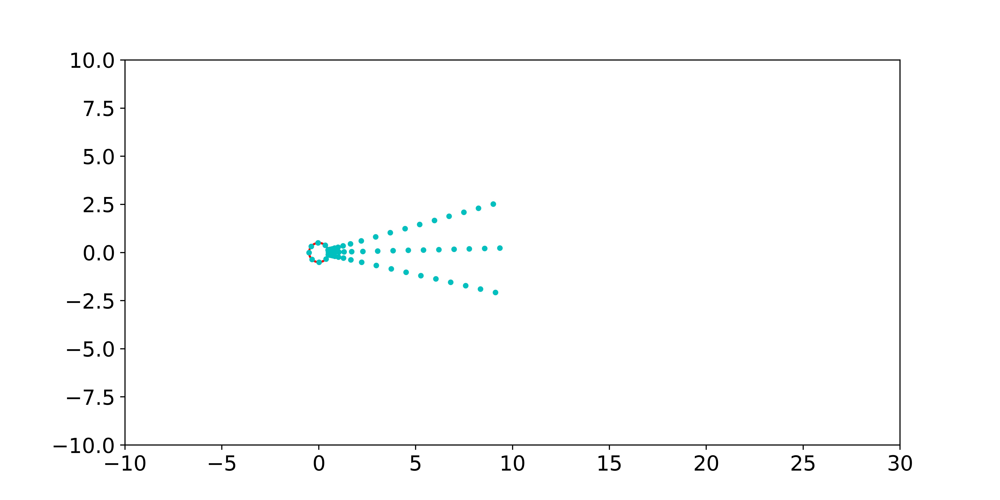**60+8（尾迹区+圆柱壁面)**  

## 5.结果
物理场预测精度采用相对 $L_2$ 误差 表示，计算公式为
$$
L_2 = \sum_{i,j=1,1}^{n,3}{\frac{|{\bf{f}}^i_j - \hat{\bf{f}}^i_j|_2^2}{|{\bf{f}}^i_j|_2^2}} 
$$
其中， *j* =1,2,3 分别表示p,u,v三个物理场，而 *i* 表示网格节点编号。 

### 5.1 网络深度

本节主要讨论不同网络深度（即，网络模型分别采用2， 4， 6， 8层全连接层）对于物理场预测精度的影响，其他网络参数固定为：网络宽度64， 对输入/输出进行归一化处理，激活函数为常用的Tahn()，采用single网络模型。
由下图可知，随着PINN模型中网络深度越来越大，物理场相对 $L_2$ 误差越来越小，当网络深度大于6时，基本稳定。有趣的是，当网络深度大于4时，加深网络对于压力场的改善已经较小。
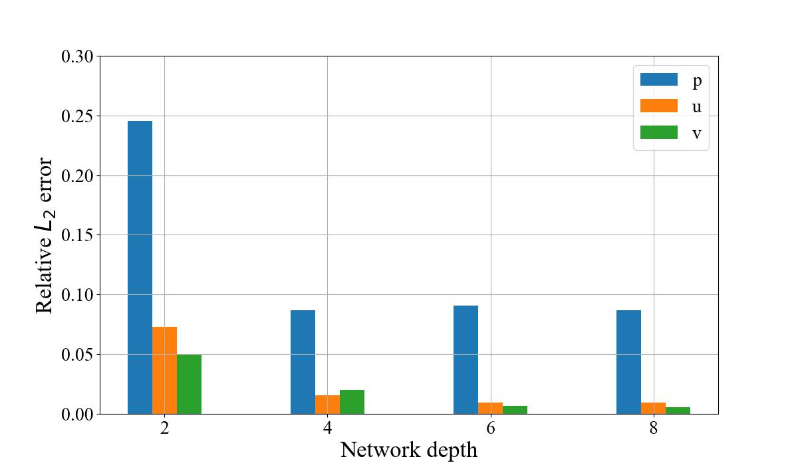

| 网络深度 N_depth | 物理场相对 $L_2$ 误差 | 预测物理场                    | 升力 $C_l$ & 阻力 $C_d$      |
| ---------------- | --------------------- | ----------------------------- | ---------------------------- |
| 8                | 0.034                 | 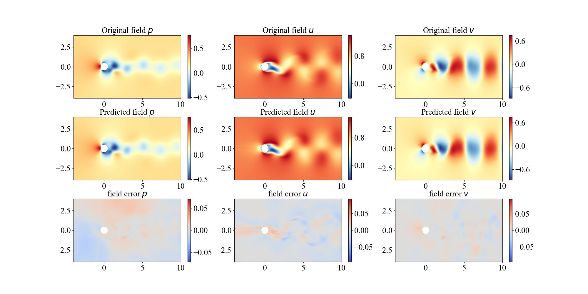 |  |


### 5.2 网络宽度

本节主要讨论不同网络宽度（即，网络模型的每层全连接层分别采用16， 32， 64 和128个神经元）对于物理场预测精度的影响，其他网络参数固定为：网络深度6， 对输入/输出进行归一化处理，激活函数为常用的Tahn()，采用single网络模型。
由下图可知，随着网络宽度的增加，物理场相对 $L_2$ 误差逐渐下降。加宽网络对于PINN模型预测性能的提升较为明显。

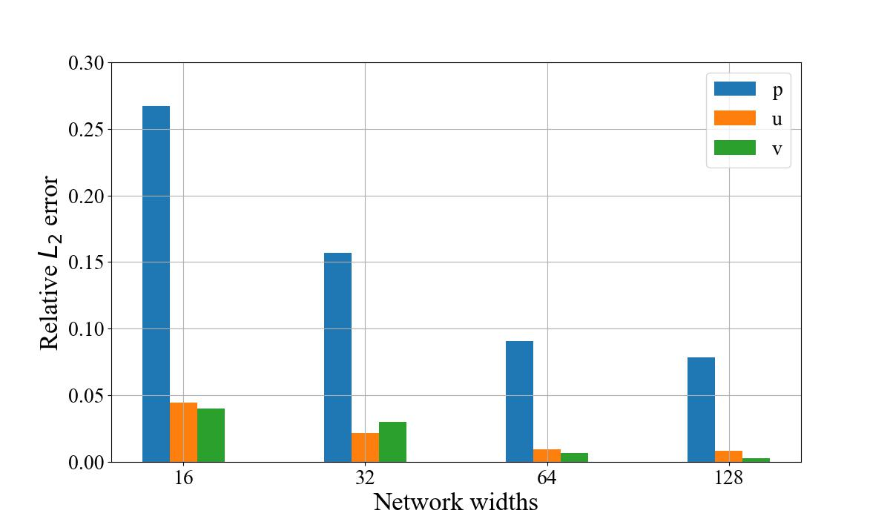

| 网络深度 N_width | 物理场相对 $L_2$ 误差 | 预测物理场                      | 升力 $C_l$ & 阻力 $C_d$        |
| ---------------- | --------------------- | ------------------------------- | ------------------------------ |
| 128              | 0.030                 | 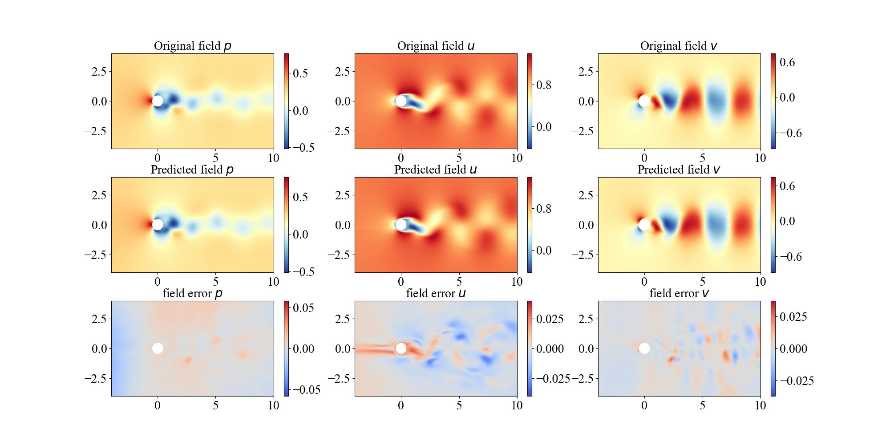 |  |

### 5.3 归一化处理

虽然该数据集中已经对于物理场进行了无量纲化处理，但是仍可以通过归一化操作进一步规范化数据，提高网络模型的预测性能、训练效率等。本节主要讨论三种不同的归一化操作（包括，对输入/输出均进行归一化，标记为’all‘； 仅对输入进行归一化，标记为’in';不做归一化处理，标记为‘nothing’）对于物理场预测精度的影响，其他网络参数固定为：网络宽度64，网络深度6，激活函数为Tahn()，采用single网络模型。
由下图可知，进行归一化操作可以显著的提升预测物理场精度，尤其是压力场（无归一化时压力场相对 $L_2$ 误差 为0.21，而进行归一化操作后降低至0.10以下）。仅对输入进行归一化的模型各项物理场相对 $L_2$ 误差均最低，效果最好，而对输入/输出均进行归一化的模型误差稍高。

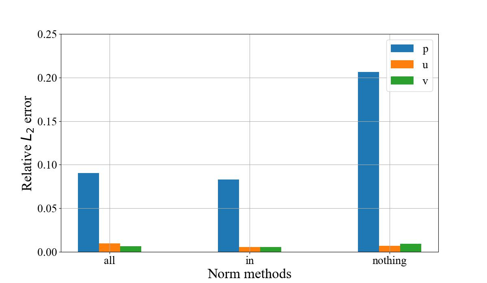

| 是否归一化       | 物理场相对 $L_2$ 误差 | 预测物理场                     | 升力 $C_l$ & 阻力 $C_d$       |
| ---------------- | --------------------- | ------------------------------ | ----------------------------- |
| 输入/输出 归一化 | 0.036                 | 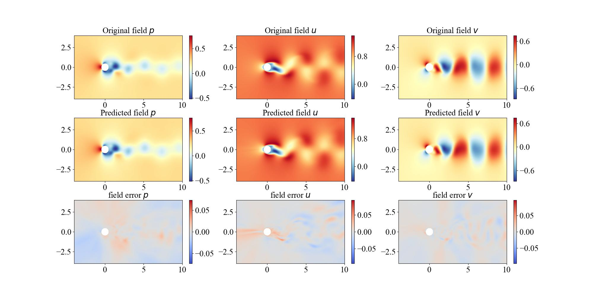 | 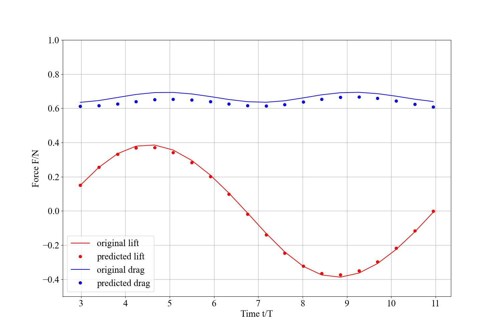 |
| 输入 归一化      | 0.031                 | 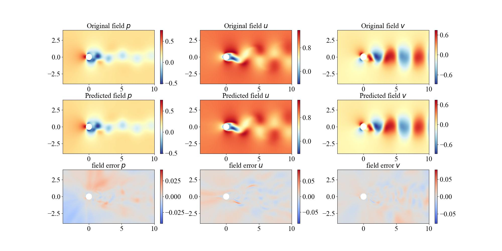  | 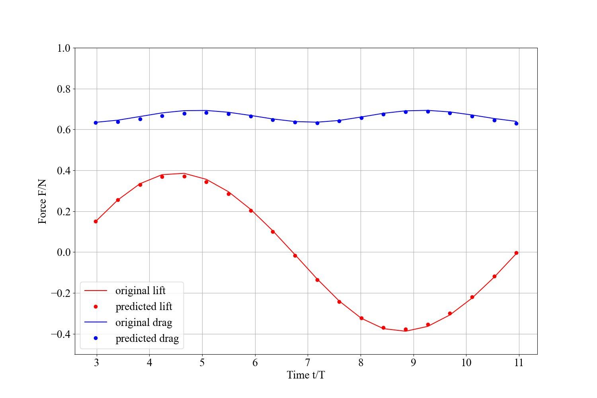  |

### 5.4 激活函数

本节主要讨论五种不同的激活函数（即，Tanh(), ReLU(), GeLU(), Sigmoid()和SiLU()）对于物理场预测精度的影响，其他网络参数固定为：网络宽度64，网络深度6， 对输入/输出进行归一化处理，采用single网络模型。
由下图可知，Tanh型综合表现最好，而ReLU 模型的各项物理场相对 $L_2$ 误差最高，预测性能最差。需要注意的是，虽然GeLU模型的压力场相对 $L_2$ 误差明显高于Tanh模型，但是其速度场的预测精度更高，在升力/阻力的预测任务上也表现更好。

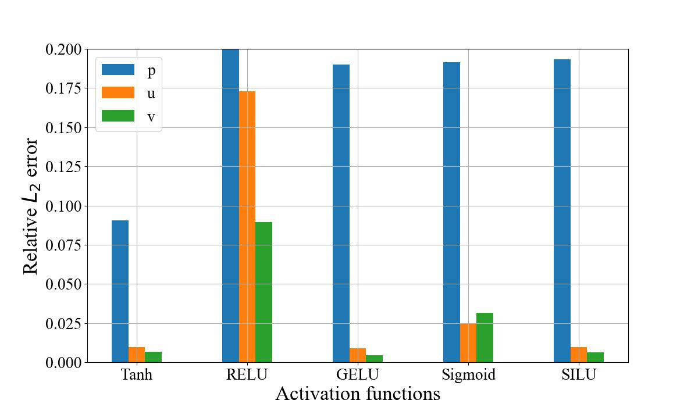

| 激活函数 | 物理场相对 $L_2$ 误差 | 预测物理场                     | 升力 $C_l$ & 阻力 $C_d$       |
| -------- | --------------------- | ------------------------------ | ----------------------------- |
| Tanh()   | 0.036                 |  |  |
| GeLU()   | 0.068                 | 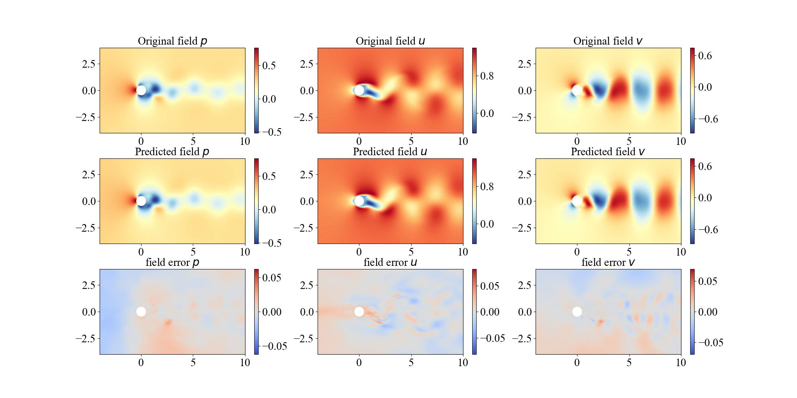     | 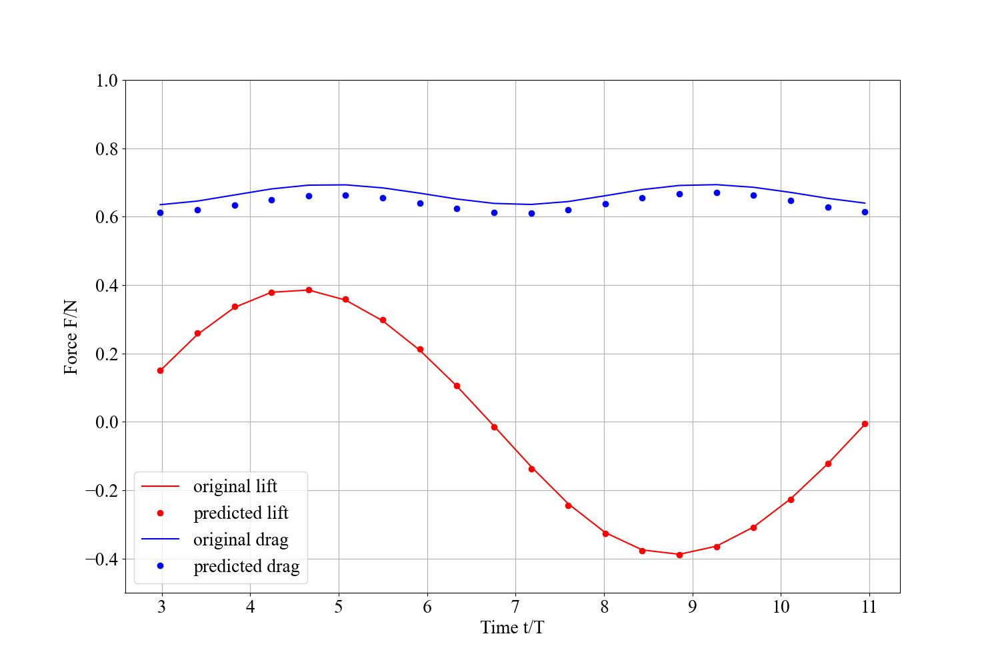     |

注： GeLU() 为Pytorch版本

### 5.5 网络模型类型

本节主要讨论两种不同的网络模型（即，采用单个全连接网络同时预测所有的物理场的‘single’模型，和针对每个物理场分别搭建一个全连接网络的‘multi’模型）对于物理场预测精度的影响，其他网络参数固定为：网络宽度64，网络深度6， 对输入/输出进行归一化处理，激活函数为常用的Tahn()。
由下图可知，采用‘multi’模型可以显著的提高压力场预测精度，而速度场的相对 $L_2$ 误差反而有所上升。总的来说，‘multi’模型在物理场预测性能上优于‘single’。

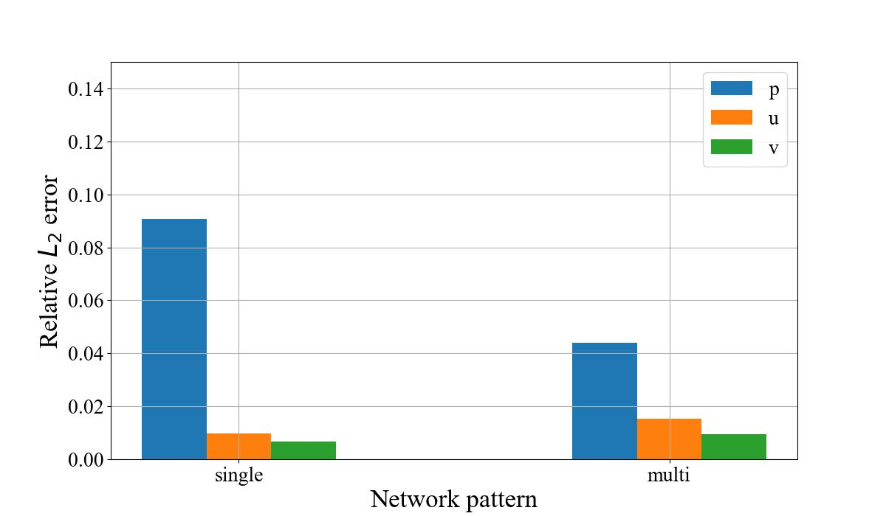

| 模型类型 | 物理场相对 $L_2$ 误差 | 预测物理场                  | 升力 $C_l$ & 阻力 $C_d$    |
| -------- | --------------------- | --------------------------- | -------------------------- |
| multi    | 0.023                 | 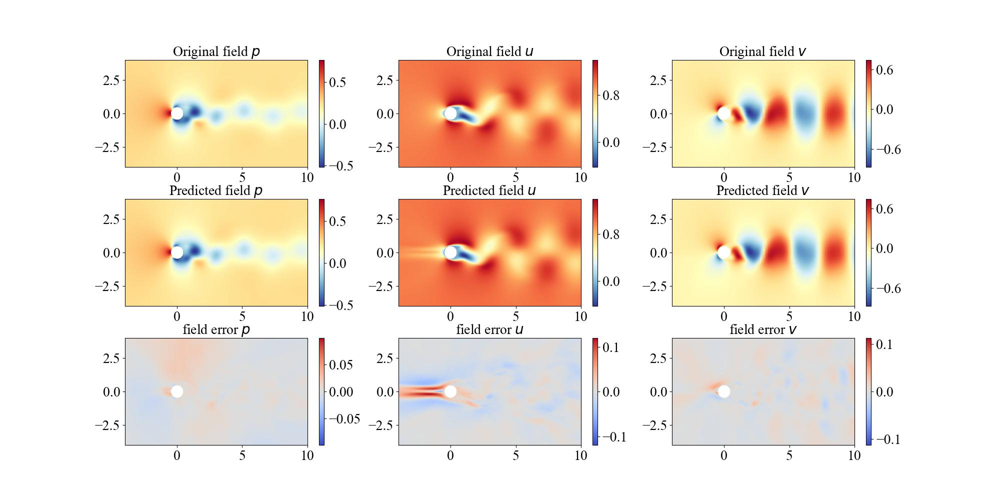 | 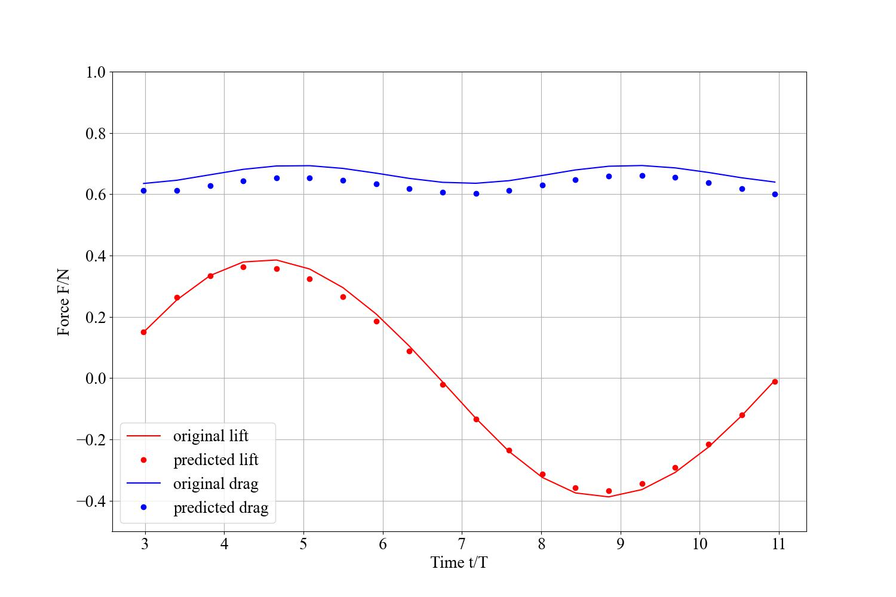 |

## 6. 存在问题

* 观察2D非定常圆柱绕流物理场可知，物理场损失主要集中在圆柱周围和尾迹部分，可进一步为重点区域分配较高的损失权重；
* 在训练前期，加大初始边界条件的损失函数权重将有利于网络的快速收敛，而到了训练后期则更应该加大NS守恒损失权重。可根据不同的训练阶段设计自适应的损失权重，以提高训练效率；
* 在pytorch框架模型的测试结果表明，gelu()激活函数可有效提高预测精度，但是在paddle框架下暂不支持该函数的高阶微分；


## 7.模型信息

训练过程中的图片保存在work文件夹下对应保存路径的train文件夹中，训练过程的日志数据保存在train.log中，最新模型保存在latest_model.pth中，测试结果的图片保存在对应保存路径的validation文件夹中，测试结果的日志数据保存在valid.log中。

| 信息          | 说明                                                         |
| ------------- | ------------------------------------------------------------ |
| 发布者        | 青龙学习小组（特别感谢[tianshao1992](https://github.com/tianshao1992) ：tianyuan@pku.edu.cn对于本问题的鼎力帮助）                             |
| 时间          | 2022.9                                                       |
| 框架版本      | Paddle 2.3.2                                                 |
| 应用场景      | 科学计算                                                     |
| 支持硬件      | CPU、GPU                                                     |
| AI studio地址 | [PINNs_Cylinder AI studio](https://aistudio.baidu.com/aistudio/projectdetail/4529544) |

[1]: R. Franke, W. Rodi, and B. Schönung, “Numerical calculation of laminar vortex-shedding flow past cylinders,” _J. Wind Eng. Ind. Aerodyn._, vol. 35, pp. 237–257, Jan. 1990, doi: 10.1016/0167-6105(90)90219-3

[2]: R. D. Henderson, “Details of the drag curve near the onset of vortex shedding,” _Phys. Fluids_, vol. 7, no. 9, pp. 2102–2104, 1995, doi: 10.1063/1.868459.

[3]: C. Y. Wen, C. L. Yeh, M. J. Wang, and C. Y. Lin, “On the drag of two-dimensional flow about a circular cylinder,” _Phys. Fluids_, vol. 16, no. 10, pp. 3828–3831, 2004, doi: 10.1063/1.1789071.

[4]:   O. Posdziech and R. Grundmann, “A systematic approach to the numerical calculation of fundamental quantities of the two-dimensional flow over a circular cylinder,” _J. Fluids Struct._, vol. 23, no. 3, pp. 479–499, 2007, doi: 10.1016/j.jfluidstructs.2006.09.004.

[5]:   J. Park and H. Choi, “Numerical solutions of flow past a circular cylinder at reynolds numbers up to 160,” _KSME Int. J._, vol. 12, no. 6, pp. 1200–1205, 1998, doi: 10.1007/BF02942594.

